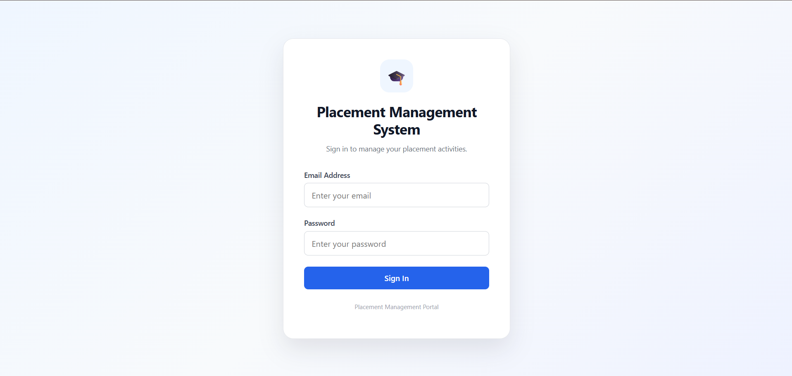
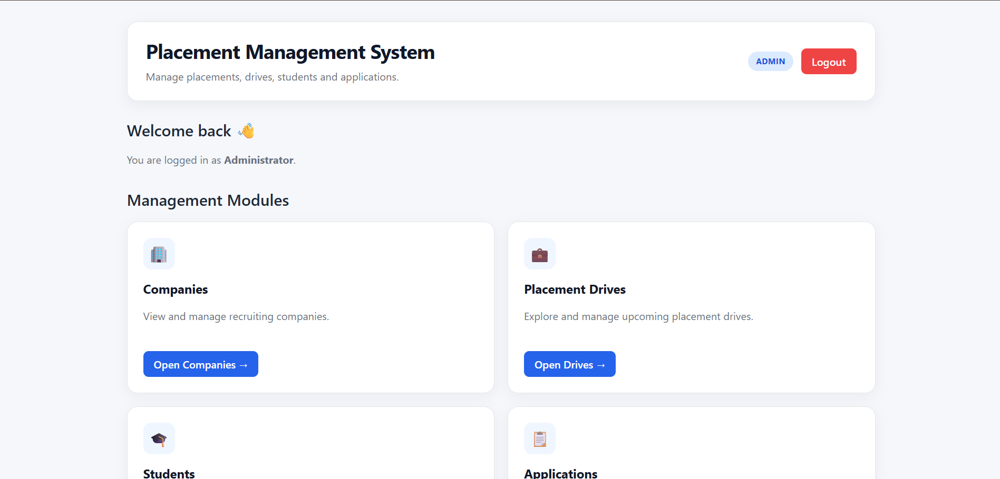
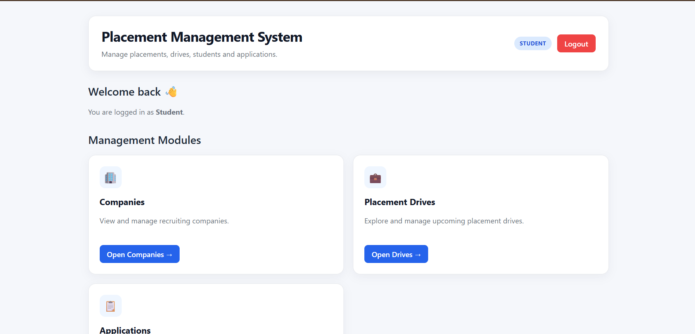
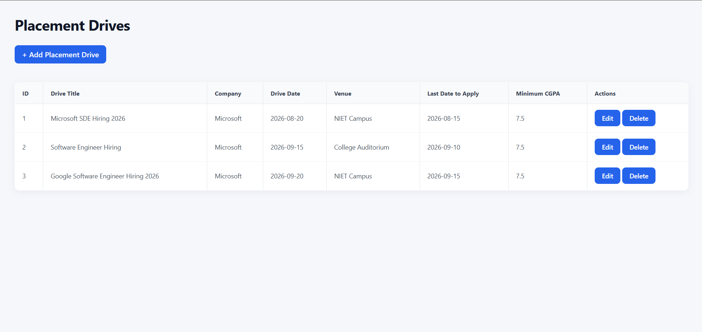
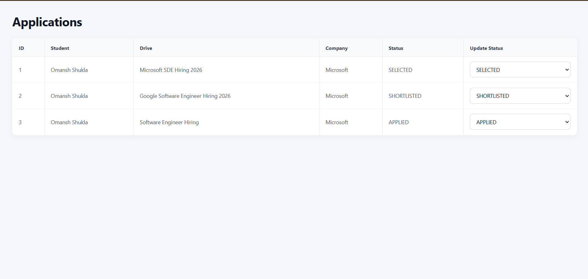
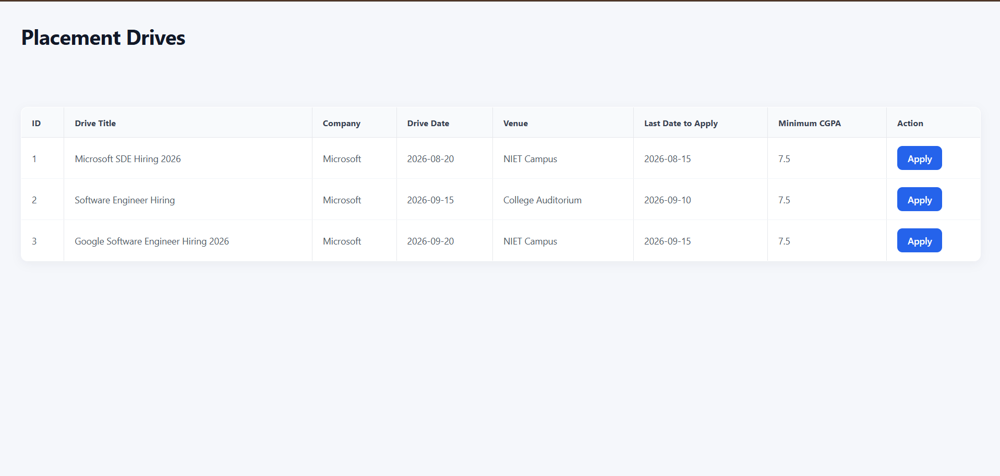
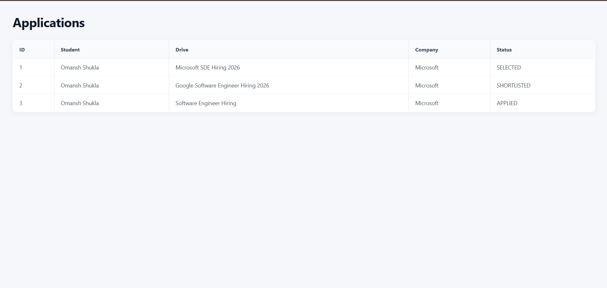

# Placement Management System

A full-stack web application for managing college placement activities, including companies, placement drives, students, and job applications.

The system provides separate access for **Administrators** and **Students** with JWT-based authentication and role-based authorization.

---

## 🚀 Features

### 🔐 Authentication & Authorization

- JWT-based user authentication
- Secure login system
- Role-based access control
- Separate Admin and Student functionality
- Protected backend APIs using Spring Security
- Stateless authentication

### 👨‍💼 Admin Features

- Manage companies
  - Add company
  - Update company
  - Delete company
  - View companies
- Manage placement drives
  - Add placement drive
  - Update placement drive
  - Delete placement drive
  - View placement drives
- Manage students
  - Add student
  - Update student
  - Delete student
  - View students
- View all student applications
- Update application status:
  - APPLIED
  - SHORTLISTED
  - SELECTED
  - REJECTED

### 🎓 Student Features

- View recruiting companies
- View placement drives
- Apply for placement drives
- Prevent duplicate applications
- View personal applications
- Track application status

---

## 🛠️ Tech Stack

### Backend

- Java 21
- Spring Boot 3.5.4
- Spring Security
- JWT
- Spring Data JPA
- Hibernate
- MySQL
- Maven

### Frontend

- React
- Vite
- JavaScript
- Axios
- React Router

### Development Tools

- IntelliJ IDEA
- MySQL
- Git
- GitHub

---

## 🏗️ Project Structure

```text
Placement-Management-Portal/
│
├── backend/
│   ├── src/
│   │   ├── main/
│   │   │   ├── java/com/omansh/backend/
│   │   │   │   ├── config/
│   │   │   │   ├── controller/
│   │   │   │   ├── dto/
│   │   │   │   ├── entity/
│   │   │   │   ├── exception/
│   │   │   │   ├── jwt/
│   │   │   │   ├── repository/
│   │   │   │   └── service/
│   │   │   └── resources/
│   │   │       └── application.properties
│   │   └── test/
│   ├── pom.xml
│   └── mvnw.cmd
│
├── frontend/
│   ├── src/
│   │   ├── pages/
│   │   ├── App.jsx
│   │   └── index.css
│   ├── package.json
│   └── vite.config.js
│
└── README.md
---

## 📸 Screenshots

### Login Page



### Admin Dashboard



### Student Dashboard



### Placement Drives



### Applications



### Student Dashboard


### Student Placement Drives



### Student Applications



---

## 🚀 Future Improvements

- Email notifications for placement updates
- Resume upload and management
- Advanced placement analytics
- Search and filtering for drives and companies
- Student profile management
- Deployment using Docker and cloud services

---

## 📌 Tested Functionality

- Admin login
- Student login
- JWT authentication
- Role-based authorization
- Company CRUD operations
- Placement drive CRUD operations
- Student CRUD operations
- Student placement application
- Duplicate application prevention
- Application status updates
- Student application tracking
- Protected Admin-only APIs

---

## 👨‍💻 Author

**Omansh Shukla**

B.Tech CSE (AI)  
NIET

GitHub: [OmanshShukla](https://github.com/OmanshShukla)

---

## 📄 License

This project is created for educational and portfolio purposes.